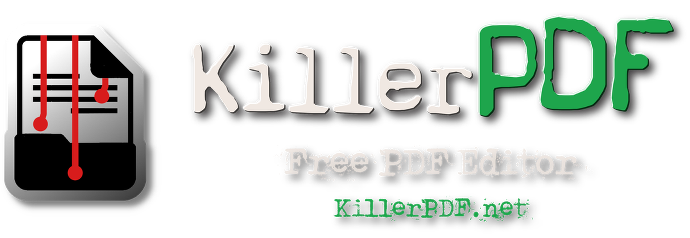
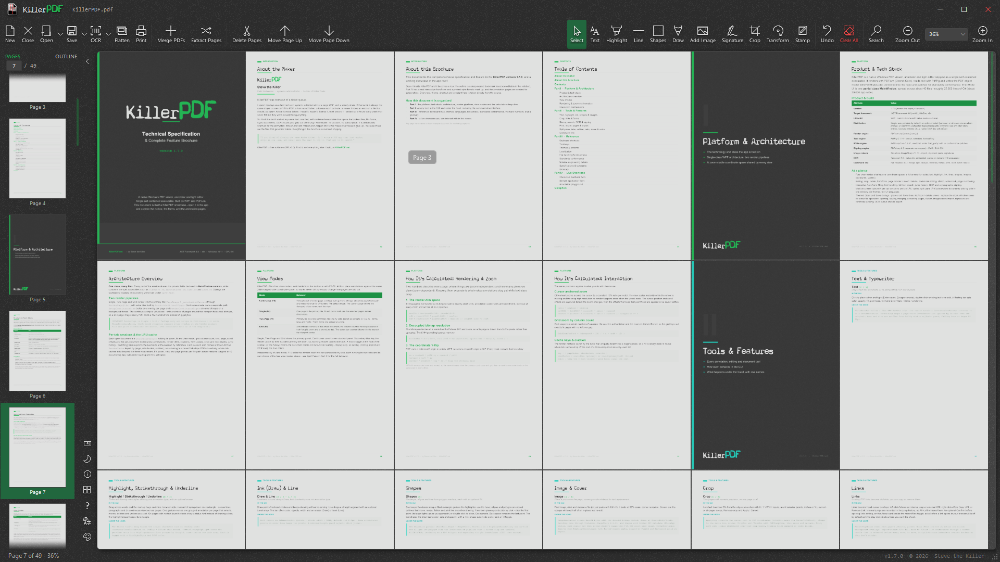
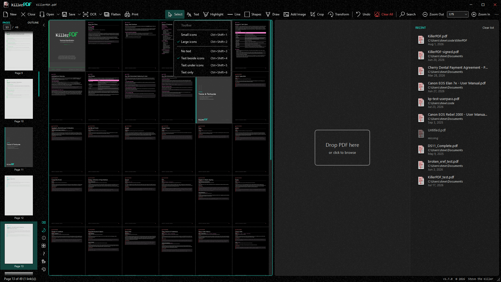
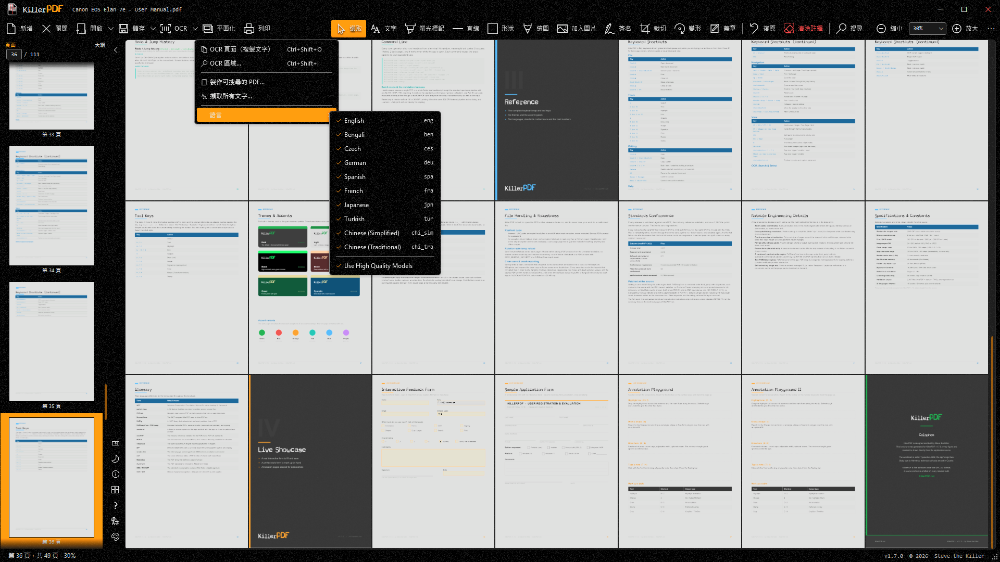
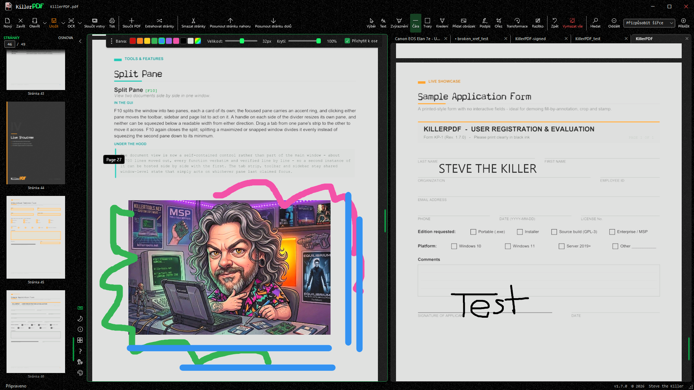
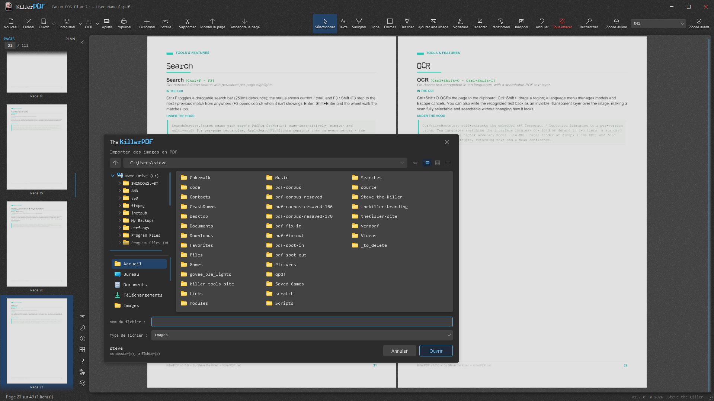
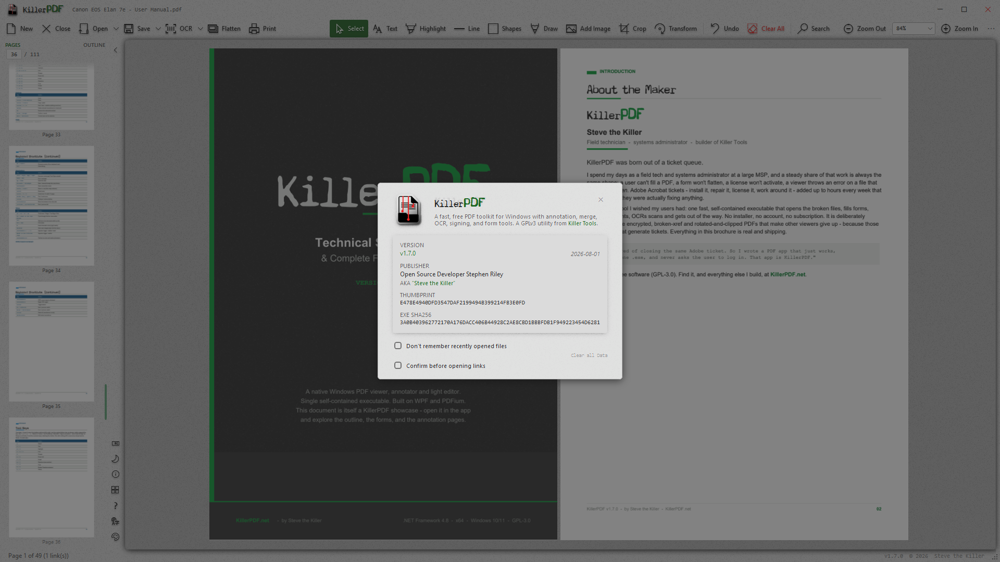

<p align="center">
  <a href="https://killerpdf.net"></a>
</p>

Free and open-source PDF editor for Windows. View, annotate, OCR, merge, split, edit text, draw, sign, fill forms, print, flatten, and open password-protected PDFs without an Adobe subscription or a phone-home. Install or run portable. Single Windows EXE, ~15.9 MB (ZIPs to 11.4MB), no runtime install required.

## Features

### Viewing & navigation

- High-quality rendering via PDFium
- Four view modes - Single Page, Continuous scroll, Two-Page, and Grid - that persist across sessions
- Tabbed documents: open several PDFs at once, each restoring its page, zoom, and view mode
- Split pane (F10): two documents side by side in one window, each pane with its own tab strip - drag a tab across to move it
- Full-text search across the whole document with highlighting; drag-select to copy text
- Outline/bookmark navigation and clickable links, including internal cross-references and TOC back-links
- Bookmark editing in the sidebar: add, inline-rename, nest, reorder, retarget, and delete - with multi-select and full undo
- Jump history: Alt+Left / Alt+Right and the mouse back / forward buttons retrace bookmark, link, and page jumps, browser-style; Home / End jump to the first / last page
- Zoom presets with scroll-wheel sync; Fit to Width and Fit Page re-apply on resize
- Full-screen mode (F11) hides all chrome so only the document fills the screen
- Recent files on the start screen and Open menu, each with its real Windows file-type icon

### Annotate & edit

- Inline text editing with font matching against the original document
- Resizable, word-wrapping text boxes with an optional whiteout background fill
- Freehand draw, a straight-line tool, and highlight - each with its own color, opacity, and width
- Full RGB color picker: saturation/value square, hue strip, hex input, screen eyedropper, and editable palette
- Select tool to move, resize, multi-select, and restyle any annotation in place
- Undo and redo (Ctrl+Z / Ctrl+Y) across annotations, text edits, stamps, and document-level operations, tracked per tab
- Insert images as resizable annotations, burned into the PDF on save
- Page-number and watermark stamping across a page range, applied as one undo

### OCR (built in, no cloud)

- OCR a whole page or a dragged region straight to the clipboard
- Make Searchable PDF: lay an invisible text layer over a scan
- Extract All Text to a `.txt` or `.md` file
- Tesseract bundled in the single EXE; extra languages download on demand

### Organize pages

- Merge multiple PDFs and split out selected pages, with drag-and-drop reordering
- Right-click sidebar: insert blank page, rotate, move, extract, or delete - on multi-page selections
- Crop with corner handles; remove crop from one page or all
- Transform: rotate by 90 degrees or a fine angle, scale, flip, and straighten a crooked scan by drawing a level line - live preview, with annotations following the transform
- Drop a folder or `.zip` onto the window to merge the PDFs and images inside into one, or open each separately

### Forms & signing

- Fill PDF forms (text, checkbox, radio) as live controls and save back to the PDF
- Digital signatures with a cloud certificate (Certum SimplySign), including click-to-sign form fields
- Draw and reuse signatures and initials, or import a PNG/JPG/BMP to place anywhere

### Output

- Print with annotations flattened, a real in-app preview, and scale / position / margins / pages-per-sheet / color / two-sided options, rendered at 300 DPI
- Save Flattened PDF: rasterize every page into a fully uneditable document
- Document Info: view and edit title, author, subject, keywords, and creator metadata

### Command line

Every core operation also runs headless from a terminal - no window, meaningful exit codes (0 success, 1 failed, 2 bad usage), and it works even while the app is open:

```powershell
KillerPDF.exe --merge out.pdf a.pdf b.pdf scan.jpg
KillerPDF.exe --extract-pages in.pdf 1-3,5 out.pdf
KillerPDF.exe --split in.pdf pages\
KillerPDF.exe --decrypt locked.pdf open.pdf [--password p]
KillerPDF.exe --to-image in.pdf imgs\ --dpi 300 --format jpg
KillerPDF.exe --flatten in.pdf flat.pdf
KillerPDF.exe --print in.pdf --printer "HP LaserJet" --pages 1-4 --copies 2
KillerPDF.exe --ocr scan.pdf searchable.pdf --lang eng
KillerPDF.exe --batch-resave inDir\ outDir\ --log report.csv
KillerPDF.exe --help
```

Each command reuses the exact pipeline its GUI equivalent runs - merges rewrite named-destination links, saves scrub the same structural hazards, OCR languages download on first use. Full reference on the [help page](https://killerpdf.net/help.html).

### Customize

- Six themes - Dark, Light, Black, Blood, Greed, Cyanotic - with per-theme accent colors, switchable live
- Toolbar style (icon size, text placement) and a resizable sidebar that docks left or right
- Localized UI in 10 languages (English, Spanish, Traditional and Simplified Chinese, German, French, Turkish, Bengali, Japanese, Czech); contribute via `TRANSLATING.md`
- Full keyboard shortcut overlay (F1 or Ctrl+?) with a list view and a visual keyboard view, color-coded by category, plus a link to the online guide

### App & files

- Single portable Windows EXE, ~15.9 MB, no runtime install
- Per-user OR all-user install: self-installs per-user to %LOCALAPPDATA% (no UAC), or machine-wide to Program Files for every account (one admin prompt, `/silent` for scripted deployment); registers as a PDF handler with a branded file icon and uninstalls cleanly via Add/Remove Programs
- Opens password-protected PDFs (prompts instead of erroring) and repairs damaged ones
- Standards-safe saves: every release is validated with veraPDF across a 2,900-file conformance corpus with a zero-regressions bar - see [validation/RESULTS.md](validation/RESULTS.md)
- Local-only: no account, no telemetry, no phone-home

## Screenshots

<p align="center">
  
  
  
  
  
  
</p>

## Requirements

- Windows 10 or 11 (x64)
- No runtime install. Everything needed is inside the EXE (targets .NET Framework 4.8, which ships with every supported Windows release).

## Download

WinGet:

```powershell
winget install killerpdf
```

Chocolately:

```powershell
choco install killerpdf
```

- Prebuilt binary: <https://github.com/SteveTheKiller/KillerPDF/releases/latest/download/KillerPDF.exe>
- Source (GPL3 corresponding source for this release): <https://github.com/SteveTheKiller/KillerPDF/releases/download/v1.7.0/KillerPDF-1.7.0-src.zip>

## Build from source

```powershell
git clone https://github.com/SteveTheKiller/KillerPDF.git
cd KillerPDF
dotnet publish -c Release
```

Output lands in `bin/Release/net48/publish/`. The publish step produces a single Costura-bundled `KillerPDF.exe` plus a versioned `KillerPDF-<version>-src.zip` for GPL3 source distribution.

Requires the .NET 8 SDK or later to build (even though the output targets .NET Framework 4.8).

The PDF write engine (PdfSharpCore, MIT) is vendored under `third_party/PdfSharpCore/` and builds as part of the solution; it carries six standards-conformance patches, each marked `KillerPDF patch` in the source. Origin commit and details are recorded in `third_party/PdfSharpCore/VENDORED.txt`.

## Changelog

See [CHANGELOG.md](CHANGELOG.md).

## License

GPLv3. See [LICENSE](LICENSE). If you fork, modify, or redistribute KillerPDF, your version must also be released under GPLv3 with source available. No exceptions for commercial rebrands.
