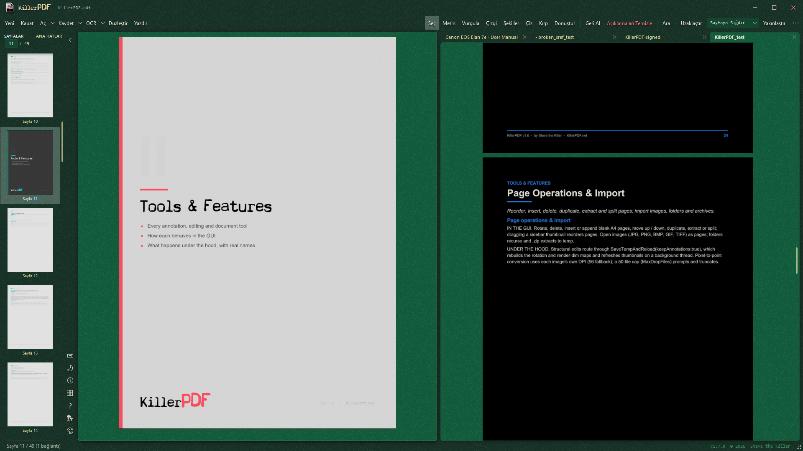

<p align="center">
  <a href="https://killerpdf.net"></a>
</p>

KillerPDF is a free, open-source PDF editor for Windows. View, annotate, OCR, merge, split, edit text, draw, sign, fill forms, print, flatten, and open password-protected PDFs without an Adobe subscription. Choose the compact Windows installer or the self-contained portable edition. The app never phones home.

Full how-tos live on the [help page](https://killerpdf.net/help.html); internals, formats, and limits on the [technical page](https://killerpdf.net/technical.html).

## The KillerPDF.Engine

KillerPDF 1.8 introduces The KillerPDF.Engine, an independent and reusable .NET library for PDF 2.0, PDF/A, and PDF/UA document processing. It is a first-class area of this monorepo with its own public API, tests, corpus tooling, architecture documentation, [README](engine/README.md), and release history.

## Features

- High-quality PDFium rendering with four view modes (Single, Continuous, Two-Page with a book layout option, Grid), tabbed documents, and a split pane for two documents side by side
- Annotate with inline text editing and font matching, word-wrapping text boxes, drawing, lines, highlights, images, and page-number or watermark stamps. Highlights use the Multiply blend so the text underneath stays readable, and every tab has its own undo and redo history.
- Built-in OCR (Tesseract bundled, no cloud): make searchable PDFs, OCR a page or region to the clipboard, extract all text; extra languages download on demand
- Organize pages: merge, split, insert, rotate, crop, extract, delete, drag-and-drop reordering; drop a folder or `.zip` onto the window to merge its contents
- Export one page or a multi-page selection as PNG or JPEG directly from the Pages panel
- Transform: rotate, scale, flip, deskew by drawing a level line, perspective correction for photographed pages, and a LEVELS section (black point, white point, midtones) for pale scans
- Forms: fill text, checkbox, radio, and comb fields as live controls and save back; digital signatures with a cloud certificate (Certum SimplySign), plus drawn or imported signatures and initials
- Print with a real in-app preview, paper size and source selection, scale / position / margins / pages-per-sheet options at 300 DPI; Save Flattened rasterizes to a fully uneditable PDF
- Full-text search with highlighting, and column-aware text selection that copies multi-column pages in reading order
- Night-mode inversion works independently in each split pane. Thirteen themes, live accent colors, and toolbar styles provide 33 looks, while the resizable sidebar can dock on either side.
- Localized UI in 15 languages, including Kazakh and Russian (contribute via `TRANSLATING.md`); full keyboard shortcut overlay on F1 with list and visual keyboard views
- Opens password-protected PDFs (prompts instead of erroring) and repairs damaged ones
- Separate standard and portable downloads: the compact installer supports per-user or machine-wide deployment, while the larger portable edition includes its own runtime
- Standards-safe saves: every release is tested against a 2,900-file veraPDF conformance corpus with a zero-regressions requirement. See [validation/RESULTS.md](validation/RESULTS.md).
- Local-only: no account, no telemetry, no phone-home

## Command line

Every core operation also runs headless from a terminal, with meaningful exit codes, even while the app is open:

```powershell
KillerPDF.exe --merge out.pdf a.pdf b.pdf scan.jpg
KillerPDF.exe --extract-pages in.pdf 1-3,5 out.pdf
KillerPDF.exe --split in.pdf pages\
KillerPDF.exe --decrypt locked.pdf open.pdf [--password p]
KillerPDF.exe --to-image in.pdf imgs\ --dpi 300 --format jpg
KillerPDF.exe --flatten in.pdf flat.pdf
KillerPDF.exe --print in.pdf --printer "HP LaserJet" --pages 1-4 --copies 2
KillerPDF.exe --ocr scan.pdf searchable.pdf --lang eng
KillerPDF.exe --batch-resave inDir\ outDir\ --log report.csv
KillerPDF.exe --help
```

Full reference on the [help page](https://killerpdf.net/help.html).

## Screenshots

| | |
| --- | --- |
| <br>**PDF comparison.** Review highlighted differences and a summary of changed and missing pages. | <br>**Transform output.** Adjust page quality and see the output pixel dimensions for your chosen DPI. |
| <br>**Fillable fields and annotations.** Add and move text fields alongside highlighted document text. | <br>**View and zoom controls.** Switch layouts and choose a zoom level directly from the footer. |

## Requirements

- Windows 10 or 11 (x64)
- The standard installer uses the .NET 10 Desktop Runtime and offers to install it when needed.
- The portable package includes the runtime and works offline without installation.

## Download

WinGet:

```powershell
winget install killerpdf
```

Chocolatey:

```powershell
choco install killerpdf
```

- Standard installer: <https://github.com/SteveTheKiller/KillerPDF/releases/latest/download/KillerPDF.exe>
- Portable edition: <https://github.com/SteveTheKiller/KillerPDF/releases/latest/download/KillerPDF-Portable.exe>
- Source (GPL3 corresponding source for this release): <https://github.com/SteveTheKiller/KillerPDF/releases/download/v1.8.3/KillerPDF-1.8.3-src.zip>

## Build from source

```powershell
git clone https://github.com/SteveTheKiller/KillerPDF.git
cd KillerPDF
dotnet publish -c Release
```

Output lands in `bin/Release/net10.0-windows/publish/`. Normal publishing produces the development build plus a versioned `KillerPDF-<version>-src.zip`. The release pipeline builds `KillerPDF.exe`, a compact framework-dependent installer, and `KillerPDF-Portable.exe`, a self-contained offline edition. Installed shortcuts launch the inner app directly for faster startup.

KillerPDF 1.8 requires the .NET 10 SDK. Both the reusable engine and the Windows application target .NET 10, with the application using `net10.0-windows`.

The desktop document pipeline uses The KillerPDF.Engine for document parsing, text extraction, writing, editing, repair, forms, annotations, signatures, and preservation-sensitive page operations. PDFium remains the rendering backend.

## Translations

UI strings live in `Strings/` (one XAML `ResourceDictionary` per locale). To add or improve a language, see [TRANSLATING.md](TRANSLATING.md). Missing keys fall back to English, so a partial translation is fine.

## Changelog

See the [KillerPDF application changelog](CHANGELOG.md) and [The KillerPDF.Engine changelog](engine/CHANGELOG.md).

## License

GPLv3. See [LICENSE](LICENSE). If you fork, modify, or redistribute KillerPDF, your version must also be released under GPLv3 with source available. No exceptions for commercial rebrands.
